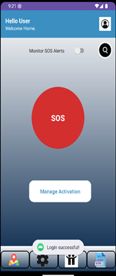
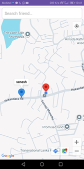

# SafeWay 🛡️

### Your Personal Guardian & Real-Time Emergency Response System

SafeWay is an enterprise-grade mobile personal safety ecosystem engineered to provide immediate, automated, and manual assistance during critical situations. Built natively for Android using **Java** and backed by **Firebase Cloud Infrastructure**, SafeWay leverages on-device hardware sensors and persistent background routing to ensure a reliable safety net is always active—even when the device is locked or asleep.

---

# 📱 Visual Gallery

|                        Home & Activation                        |                      Live Map Tracking                      |                         Emergency SOS Active                        |
| :-------------------------------------------------------------: | :---------------------------------------------------------: | :-----------------------------------------------------------------: |
|  |  |  |


---

# 🚀 Core Features & Capabilities

## 🔹 Intelligent Gesture Engine

Implements a gesture-based **Shake to Alert** mechanism alongside optional physical volume-key confirmation to safely dispatch alarms while reducing false positives.

## 🔹 Continuous Foreground Tracking

Uses dedicated Android foreground services compliant with Android 14+ guidelines to stream accurate live telemetry during emergencies.

## 🔹 The Guardian Network

A decentralized mutual-protection grid where designated contacts receive:

* Real-time emergency notifications
* Live GPS tracking
* Interactive route maps
* Active emergency state updates

## 🔹 Evidence Vault

Coordinates directly with on-device camera hardware upon SOS activation, silently caching:

* Video evidence
* Audio environment capture
* Location-stamped metadata

## 🔹 Safe-Zone Scheduling

Allows automated safety windows such as:

* Late-night travel monitoring
* Campus commute tracking
* Scheduled safety check-ins

Even if the user forgets to arm the system manually, SafeWay can remain actively monitoring.

---

# 🛠️ Deep Technical Stack

| Architecture Layer       | Technology Implemented                     |
| :----------------------- | :----------------------------------------- |
| **Target OS Version**    | Android 8.0 (API 26) → Android 14 (API 34) |
| **Development Language** | Java (Native Android SDK)                  |
| **Cloud Infrastructure** | Firebase Realtime Database                 |
| **Authentication Layer** | Firebase Authentication                    |
| **Maps & Telemetry**     | Google Play Services + Google Maps API     |
| **Sensor Framework**     | Accelerometer via `SensorEventListener`    |
| **Background Services**  | Android Foreground Service Architecture    |
| **Push Communication**   | Firebase Cloud Messaging (FCM)             |

---

# 📐 Sensor Physics: Shake Detection Logic

To separate normal movement patterns from actual emergency gestures, SafeWay processes raw accelerometer input through a **High-Pass Filtering System**.

The baseline gravity component is continuously estimated using a low-pass filter:

$$
gravity[i] = \alpha \cdot gravity[i] + (1 - \alpha) \cdot event.values[i]
$$

The isolated linear acceleration values are then calculated and validated using the Euclidean magnitude equation:

$$
linearMag = \sqrt{lx^2 + ly^2 + lz^2}
$$

A distress event is triggered when:

* `linearMag > 14.0 m/s²`
* Cooldown interval `Δt > 3000 ms`

Once verified, the emergency broadcast pipeline automatically executes.

---

# 📱 Android Permissions Required

SafeWay requires the following Android permissions for reliable operation:

| Permission                     | Purpose                           |
| :----------------------------- | :-------------------------------- |
| `ACCESS_FINE_LOCATION`         | High-accuracy GPS tracking        |
| `ACCESS_BACKGROUND_LOCATION`   | Location updates while minimized  |
| `FOREGROUND_SERVICE_LOCATION`  | Persistent emergency tracking     |
| `FOREGROUND_SERVICE_DATA_SYNC` | Android 14+ background compliance |
| `POST_NOTIFICATIONS`           | Active emergency notifications    |
| `RECORD_AUDIO`                 | Environmental audio evidence      |
| `CAMERA`                       | Emergency video capture           |
| `INTERNET`                     | Firebase cloud synchronization    |

---

# ⚙️ Project Setup & Installation

## 1️⃣ Environment Requirements

* Android Studio Jellyfish or newer
* Java Development Kit (JDK) 17
* Active Firebase Project

---

## 2️⃣ Clone the Repository

```bash
git clone https://github.com/Xenethb/SafeWay.git
```

---

## 3️⃣ Firebase Backend Initialization

### Create Firebase Project

* Open Firebase Console
* Register a new Android app
* Package name:

```plaintext
com.s23010602.safeway
```

### Download Firebase Configuration

Download:

```plaintext
google-services.json
```

Place the file inside:

```plaintext
/app
```

---

## 🔒 Security Best Practice

Add the following to `.gitignore`:

```plaintext
app/google-services.json
```

This prevents sensitive credentials from being uploaded publicly.

---

## 4️⃣ Gradle Sync

After configuration:

* Sync Gradle
* Build project
* Run on Android device or emulator

---

# 📖 How to Use SafeWay

## 1️⃣ Account Registration

Launch the app and complete onboarding using:

```plaintext
CreateAccountActivity
```

Users register using:

* Email
* Phone Number
* Firebase Authentication

---

## 2️⃣ Build Your Guardian Network

Use:

```plaintext
SearchActivity
```

Search verified users by email and add trusted emergency contacts.

---

## 3️⃣ Configure Trigger Mode

Navigate to:

```plaintext
Manage Activation Settings
```

Available modes:

### Standard Shake

Instantly triggers emergency protocol upon strong acceleration.

### Shake + Volume Press

Adds secondary hardware confirmation using physical volume keys.

---

## 4️⃣ Trigger Emergency SOS

Once activated:

* Guardians receive emergency notifications
* Live GPS streaming begins
* Foreground safety service activates
* Evidence recording initializes

Users can safely terminate the emergency session using:

```plaintext
Cancel Service
```

---

# 🧠 System Architecture Overview

SafeWay follows a hybrid architecture combining:

* Native Android foreground services
* Sensor event processing
* Firebase realtime synchronization
* Persistent emergency notification channels
* Hardware-assisted emergency detection

The system is designed to remain operational even under:

* Screen lock
* Background execution limits
* Power optimization restrictions
* Android idle states

---

# 🎯 Real-World Use Cases

SafeWay can assist during:

* Night travel
* Medical emergencies
* Harassment situations
* Campus safety monitoring
* Solo commuting
* Urban public transport travel
* Elderly emergency monitoring

---

# 👨‍🎓 Academic Affiliation

| Category          | Information                                                                                   |
| :---------------- | :-------------------------------------------------------------------------------------------- |
| **Institution**   | The Open University of Sri Lanka                                                              |
| **Course**        | EEY4369 - Mobile Application Development                                                        |
| **Project Focus** | Mobile emergency response systems using hardware sensor integration and cloud synchronization |

---


# ⭐ Support the Project

If you found this project useful:

* ⭐ Star the repository
* 🍴 Fork the project
* 🛡️ Contribute to improving community safety technology

---

# 📬 Contact

For collaborations, improvements, or research discussions, feel free to connect through the repository profile.

---

# 🛡️ SafeWay

### *"Because every second matters during an emergency."*
